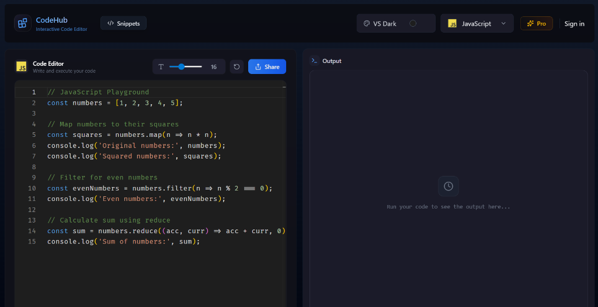

<div align="center">
  
  <h1>CodeHub</h1>
  <p>An Interactive Code Editor & Developer Platform</p>
  <a href="https://codehub-one-liart.vercel.app/"><strong>Explore the Live Website »</strong></a>
</div>

<br />



## 📖 About The Project
CodeHub is a powerful, interactive web-based code editor and snippet-sharing platform. It empowers developers to write, execute, and share code snippets in multiple programming languages directly from their browser. With a sleek UI, robust real-time backend syncing, and a seamlessly integrated Pro-tier billing system, CodeHub serves as a premium playground for modern developers.

## 🚀 Tech Stack

### Frontend & Framework
- **Next.js 16** - Core React Framework (App Router)
- **TypeScript** - Strongly typed architecture
- **Tailwind CSS** - Utility-first styling & responsive design
- **Framer Motion** - Fluid UI animations and transitions
- **Monaco Editor** - The code editor that powers VS Code (`@monaco-editor/react`)
- **Zustand** - Lightweight, fast global state management

### Backend & Database
- **Convex** - Real-time Database and Serverless Backend Functions
- **Clerk** - Secure Authentication and Session Management
- **Stripe** (via Clerk) - Subscription & Billing management for Pro accounts

### Deployment
- **Vercel** - Native continuous deployment via GitHub integration. Simply push to the `main` branch, and Vercel automatically builds and deploys the updates to the edge network.

---

## 🗺️ Application Flow
1. **Authentication:** Users securely sign up/in using Clerk.
2. **Coding Environment:** The main dashboard features a fully responsive Monaco Editor where users can write code in various languages (JavaScript, Python, C++, etc.).
3. **Execution:** Code is safely executed, and standard output/errors are streamed back to the customized interactive terminal component.
4. **Cloud Syncing:** Users can save their favorite code snippets. These are instantly stored and synced in real-time across devices using the Convex database.
5. **Pro Tier:** Users can seamlessly upgrade to a Pro subscription. The payment safely routes through Stripe (via Clerk), which fires a webhook directly to the Convex backend to automatically unlock premium developer features.

---

## 📂 Folder Structure

```text
code-hub/
├── app/                  # Next.js App Router
│   ├── (root)/           # Main application workspace & Editor UI
│   ├── pricing/          # Subscription & Pro-tier upgrade flow
│   ├── profile/          # User profiles and personal statistics
│   └── snippets/         # Snippet viewing, commenting, and sharing
├── components/           # Reusable React components (Modals, Headers, Buttons)
├── convex/               # Convex Backend
│   ├── schema.ts         # Database tables and indexes
│   ├── users.ts          # User and subscription syncing mutations
│   ├── snippets.ts       # Code snippet CRUD operations
│   └── http.ts           # Webhook listeners (e.g., Clerk billing events)
├── public/               # Static assets (Favicons, Language Icons, SVGs)
├── store/                # Zustand state (Global Editor state, execution state)
└── types/                # Global TypeScript definitions and interfaces
```

---

## 🛠️ Local Development Setup

To get a local copy up and running, follow these simple steps:

### Prerequisites
- Node.js (v18+)
- Bun (v1+)

### Installation
1. Clone the repo:
   ```sh
   git clone https://github.com/your-username/code-hub.git
   ```
2. Install NPM packages using Bun:
   ```sh
   bun install
   ```
3. Set up your `.env` file with the required keys for Clerk and Convex:
   ```env
   NEXT_PUBLIC_CLERK_PUBLISHABLE_KEY=pk_test_...
   CLERK_SECRET_KEY=sk_test_...
   CONVEX_DEPLOYMENT=dev:...
   NEXT_PUBLIC_CONVEX_URL=https://...
   ```
4. Start the Convex backend environment:
   ```sh
   bunx convex dev
   ```
5. Run the Next.js development server:
   ```sh
   bun run dev
   ```

Open [http://localhost:3000](http://localhost:3000) to view it in the browser!
