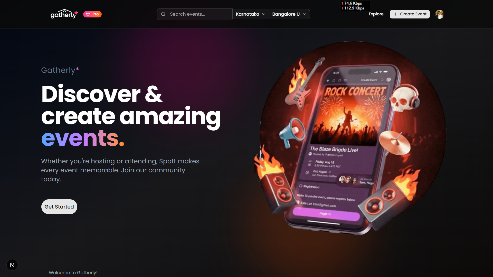
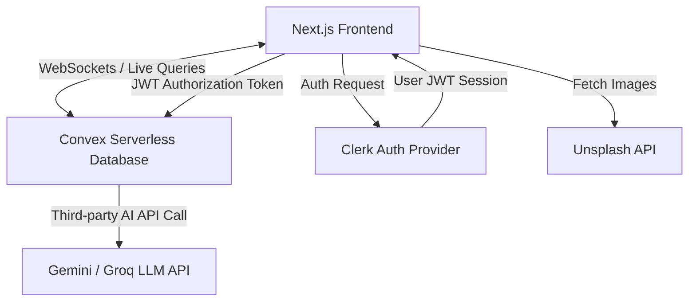
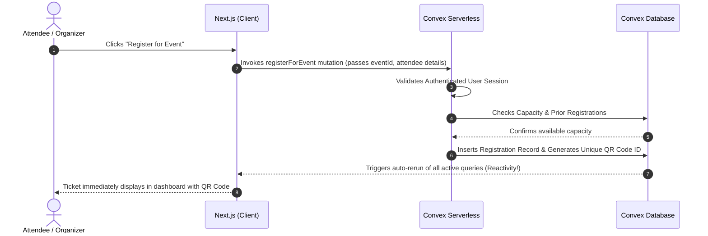
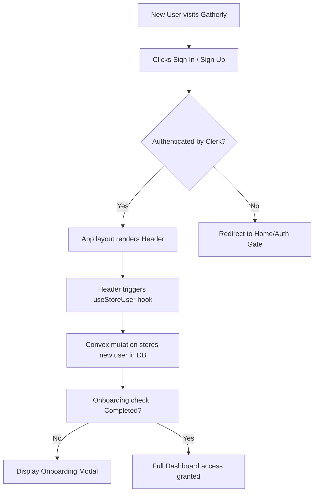
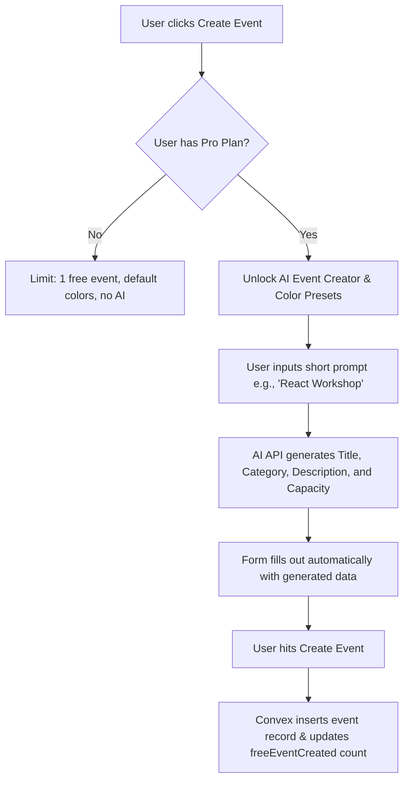
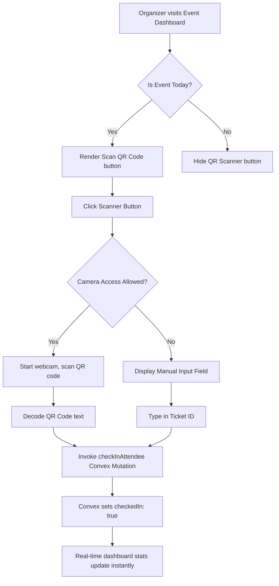

# 🎟️ Gatherly - Delightful Events Start Here

[](https://nextjs.org/)
[](https://www.convex.dev/)
[](https://clerk.dev/)
[](https://react.dev/)

Gatherly is a next-generation, production-ready SaaS event management and ticketing platform. It empowers organizers to seamlessly create, manage, promote, and monetize events, while providing attendees with a delightful experience to discover events, register, and receive digital tickets with QR codes for fast, real-time venue check-in. Incorporating advanced AI capabilities, Gatherly elevates event planning by automating title, description, category, and capacity recommendations.

---

## 📖 Table of Contents

1. [Project Overview](#-project-overview)
2. [About The Project](#-about-the-project)
3. [Features](#-features)
4. [Tech Stack](#-tech-stack)
5. [System Architecture](#-system-architecture)
6. [Project Flow](#-project-flow)
7. [Folder Structure](#-folder-structure)
8. [Database Design](#-database-design)
9. [API Documentation](#-api-documentation)
10. [Authentication & Authorization](#-authentication--authorization)
11. [Subscription & Billing (SaaS Model)](#-subscription--billing-saas-model)
12. [AI Features](#-ai-features)
13. [Installation Guide](#-installation-guide)
14. [Environment Variables](#-environment-variables)
15. [Performance Optimizations](#-performance-optimizations)
16. [Security Considerations](#-security-considerations)
17. [Deployment](#-deployment)
18. [Screenshots](#-screenshots)
19. [Future Improvements](#-future-improvements)
20. [Contributing](#-contributing)
21. [License](#-license)
22. [Author](#-author)

---

## 🔗 Live Demo & Preview

🚀 **Live Deployment URL**: [https://gatherly-saas.vercel.app/](https://gatherly-saas.vercel.app/)

### Platform Preview


---

## 🌟 Project Overview

### What is Gatherly?
Gatherly is a comprehensive SaaS-based event management, scheduling, and ticketing application. It bridges the gap between event organizers and community members, streamlining the entire lifecycle of an event from initial design and marketing to attendee check-ins at the door.

### Main Purpose & Goals
The core objective of Gatherly is to make event planning accessible, highly customizable, and effortless. By offering an aesthetic, high-performance interface paired with state-of-the-art serverless architecture and AI assistance, Gatherly removes the heavy technical overhead typically associated with event hosting.

### The Problem It Solves
1. **Administrative Overload**: Organizers struggle with multiple disconnected tools for ticketing, listing, check-in, and marketing. Gatherly consolidates all of these into one unified, beautiful dashboard.
2. **Complex Ticket Check-In**: Paper-based check-ins or manual search lists slow down entry. Gatherly introduces instant QR code scanning with a manual entry fallback that runs entirely in the browser.
3. **Blank Page Syndrome**: Drafting event titles, descriptions, and picking capacities can be daunting. Gatherly’s AI integration fills out standard templates instantly.
4. **Poor SaaS Scalability**: Heavy databases and hosting costs slow down scaling. Gatherly utilizes Convex's real-time, reactive serverless database, scaling instantly to millions of requests with zero cold starts.

### Target Users
* **Professional Event Organizers**: Meetup hosts, conference creators, and local event managers looking to streamline ticketing and track attendee statistics in real-time.
* **Community & Meetup Groups**: Small developer circles, local interest clubs, and sports coordinators.
* **Individual Attendees**: Community members looking to discover premium local and national events, track their tickets, and check-in effortlessly.

---

## 💡 About The Project

### Key Objectives
* Deliver an ultra-fast, reactive user experience with Next.js App Router and serverless streaming.
* Maintain a highly polished, responsive visual design featuring harmonious dark theme gradients and glassmorphism.
* Ensure real-time state synchronization across all client browsers (e.g., live registration counts, instant check-in status).

### Real-World Use Cases
* **Tech Conferences & Local Meetups**: Seamless attendee registration, professional dashboard tracking, and fast check-in at the venue.
* **Paid Masterclasses & Seminars**: Organizers can utilize subscription-level metrics and offline payment indicators.
* **Community Festivals**: Instant discovery of events nearby using geolocation queries.

### Business Value & User Benefits
* **For Organizers**: Maximized attendance through AI copywriting, actionable dashboard insights (check-in rates, revenue), and professional branding tools.
* **For Attendees**: A central, mobile-friendly ticket wallet (`/my-tickets`) displaying beautiful QR codes, making the entry process frictionless.

---

## ⚡ Features

### 🔒 Authentication & Security
* Unified, modern sign-in and sign-up modals powered by **Clerk**.
* Secure JWT session token exchanges with Convex for server-side authorization.
* Automated database profile creation on first sign-in using reactive database hooks.

### 📅 Event Management (Free vs. Pro)
* **Free Plan Features**:
  * Create up to 1 active event with a gorgeous default theme color.
  * Register attendees and export registration lists to CSV.
  * Instant ticket generation with real-time QR codes.
* **Pro Plan Features**:
  * Unlimited event creation.
  * Full color-preset customizations and custom premium themes.
  * Access to the AI Event Generator.
  * Advanced organizer dashboards tracking ticket revenue, check-in percentages, and time-remaining metrics.

### 🤖 AI-Powered Capabilities
* **AI Event Creator**: Leverages Generative AI to generate titles, rich event descriptions, categories, and suggested capacities based on minimal user prompts.
* Automated validation workflows to ensure generated metadata conforms to standard parameters.

### 🎟️ Ticketing & Fast Check-In
* Real-time QR Code ticket generation inside `/my-tickets`.
* **In-Browser QR Scanner**: Enables organizers to scan tickets instantly at the door using mobile or webcam feeds.
* **Manual Check-In Fallback**: If camera access is denied, organizers can check in attendees using ticket ID entry or direct one-click dashboard check-ins.

---

## 🛠️ Tech Stack

Gatherly leverages a state-of-the-art tech stack selected for performance, developer experience, and scalability:

| Layer | Technology | Why Chosen? | Integration Details |
| :--- | :--- | :--- | :--- |
| **Frontend** | Next.js 16.2 | Chosen for its React 19 compatibility, App Router flexibility, and server-side rendering capability. | Serves as the core UI and routing framework. |
| **Styling** | Tailwind CSS 4.0 | Allows for rich, modern animations, glassmorphic styles, and fluid grid systems without bulk. | Implements styling systems and custom layouts. |
| **Database** | Convex | Serverless, fully ACID-compliant reactive database. Auto-re-evaluates active queries upon data shifts. | Stores users, events, and registration records. |
| **Backend** | Convex Serverless | Zero cold starts, automatic WebSockets, and fully reactive queries. | Exposes all mutative and search endpoints safely. |
| **Auth** | Clerk | Leading authentication provider with pre-built user management screens and JWT session controls. | Handles user credentials and securely informs Convex. |
| **AI Engine** | Google Gemini / Groq | Provides high-speed, state-of-the-art text generation. | Generates complete event templates based on prompts. |
| **QR Library** | `react-qr-code` & `html5-qrcode` | High-fidelity SVG generator and camera-access scanner. | Renders tickets and processes camera streams. |

---

## 📐 System Architecture

### High-Level System Architecture



### Client-Side vs. Server-Side Data Flow



---

## 🔄 Project Flow

### 1. User Registration & Auth Flow


### 2. Event Creation & AI Generation Flow


### 3. Ticket Check-In Flow


---

## 📂 Folder Structure

```
gatherly/
├── app/                      # Next.js App Router root
│   ├── (auth)/               # Clerk Authentication Layouts
│   ├── (main)/               # Core Application pages (protected)
│   │   ├── create-event/     # Event Creator Page & AI Components
│   │   ├── my-events/        # Organizers Dashboard & QR Scanner
│   │   └── my-tickets/       # User Digital Tickets wallets
│   ├── (public)/             # Public pages (landing, explore, event details)
│   │   ├── explore/          # Geolocation Search & Category filters
│   │   └── events/           # Dynamic slug pages for registration
│   ├── layout.js             # Global Layout with Providers
│   └── page.jsx              # Landing / Splash page
├── components/               # Shareable UI components
│   ├── ui/                   # Shadcn UI low-level components
│   ├── Header.jsx            # Dynamic navigation bar
│   ├── EventCard.jsx         # Uniform Event display component
│   └── onboarding-modal.jsx  # Interactive onboarding modal
├── convex/                   # Convex Backend code & endpoints
│   ├── _generated/           # Auto-generated client/server API types
│   ├── schema.js             # Database Table Schemas & Indexes
│   ├── users.js              # User mutations & queries
│   ├── events.js             # Event creation, deletion, organizer queries
│   ├── registrations.js      # Ticketing & Check-in logic
│   ├── explore.js            # Geolocation queries & featured listings
│   └── dashboard.js          # Organizer statistics calculations
├── hooks/                    # Reusable custom React hooks
│   ├── use-store-user.js     # Post-auth synchronization hook
│   └── use-convex-query.js   # Custom reactive wrapper for toast management
├── lib/                      # Helper libraries and static assets
│   ├── data.js               # Category layouts & static lists
│   └── location-utils.js     # Slug generators for state & city routes
└── public/                   # Static images, logos, & icons
```

---

## 🗄️ Database Design

Gatherly operates on Convex's document-store database. The schema is defined in [convex/schema.js](file:///c:/Programming/NEXT%20JS%20PROJECTS/gatherly/convex/schema.js).

### Tables & Relationships

#### 1. `users` Table
Stores authentication profiles and subscription-specific information:
* `name` (string): Profile name.
* `email` (string): Authenticated email.
* `tokenIdentifier` (string): Unique ID matches Clerk profile.
* `hasCompletedOnboarding` (boolean).
* `location` (object): `city` (string), `state` (string), `country` (string).
* `interests` (array of strings).
* `freeEventCreated` (number): Tracks event quota for SaaS limit check.
* **Index**: `by_token` on `["tokenIdentifier"]`.

#### 2. `events` Table
Stores complete details for created events:
* `title` (string), `description` (string), `slug` (string).
* `organizerId` (Id of users), `organizerName` (string).
* `category` (string), `tags` (array of strings).
* `startDate` (number - epoch timestamp), `endDate` (number).
* `timezone` (string).
* `locationType` (physical / online).
* `venue` (string), `address` (string), `city` (string), `state` (string), `country` (string).
* `capacity` (number), `ticketType` (free / paid), `ticketPrice` (number), `registrationCount` (number).
* `coverImage` (string), `themeColor` (string).
* **Indexes**:
  * `by_organizer` on `["organizerId"]`
  * `by_category` on `["category"]`
  * `by_start_date` on `["startDate"]`
  * `by_slug` on `["slug"]`
  * **Search Index**: `search_title` on `title` for real-time query match.

#### 3. `registrations` Table
Tracks registrations and ticket assignments:
* `eventId` (Id of events).
* `userId` (Id of users).
* `attendeeName` (string), `attendeeEmail` (string).
* `qrCode` (string): Unique UUID assigned to the ticket.
* `checkedIn` (boolean).
* `checkedInAt` (number).
* `status` (confirmed / cancelled).
* **Indexes**:
  * `by_event` on `["eventId"]`
  * `by_user` on `["userId"]`
  * `by_event_user` on `["eventId", "userId"]`
  * `by_qr_code` on `["qrCode"]`

---

## 🔌 API Documentation

All operations are executed via Convex Serverless Functions. Below are input/output schemas for the primary APIs:

### 1. `users.getCurrentUser` (Query)
Fetches the current authenticated user profile.
* **Input**: None (Reads JWT header)
* **Output**: User document or `null`.

### 2. `events.createEvent` (Mutation)
* **Input**:
```json
{
  "title": "React Advanced Workshop",
  "description": "Learn complex React 19 patterns...",
  "category": "technology",
  "tags": ["react"],
  "startDate": 1780077000000,
  "endDate": 1780163400000,
  "timezone": "Asia/Kolkata",
  "locationType": "physical",
  "city": "Bengaluru",
  "state": "Karnataka",
  "country": "India",
  "capacity": 50,
  "ticketType": "free",
  "hasPro": false
}
```
* **Output**: `eventId` (id of events).

### 3. `registrations.checkInAttendee` (Mutation)
Updates the attendee's check-in status.
* **Input**:
```json
{
  "qrCode": "EVT-1780077000000-ABCDEF"
}
```
* **Output**:
```json
{
  "success": true,
  "message": "Attendee checked in successfully",
  "registration": {
    "checkedIn": true,
    "checkedInAt": 1780078000000
  }
}
```

---

## 🔒 Authentication & Authorization

Gatherly enforces strict role-based and subscription-based route checks:
1. **Unauthenticated Access**: Public visitors can browse the homepage, search events via `/explore`, and read details on public `/events/[slug]` routes.
2. **Authenticated Access**: Triggered by Clerk providers. Gives access to `/my-tickets` and onboarding layouts.
3. **Owner Protection**: Dashboards at `/my-events/[eventId]` verify that the requesting user matches the `organizerId` of the event, preventing cross-tenant access.
4. **Subscription Gate**: The server-side checks verify subscription attributes (e.g., event counters for Pro plans) prior to committing entries to the database.

---

## 💳 Subscription & Billing (SaaS Model)

Gatherly uses a tiers-of-service model to monetize features.

| Metric / Feature | Free Tier | Pro Tier |
| :--- | :--- | :--- |
| **Monthly Events** | Max 1 Active Event | Unlimited Events |
| **Theme Customization** | Single Default Color | Unlimited Palette & Presets |
| **AI Assistance** | Disabled | Fully Enabled |
| **CSV Exporting** | Enabled | Enabled |
| **Real-time Analytics** | Basic | Advanced (Checked-In rate, Revenue charts) |

---

## 🤖 AI Features

Gatherly features an integrated **AI Event Generator**:
* **Strategy**: Uses detailed prompt structures to ask the LLM to output clean JSON schemas representing title, description, category, and suggested capacities.
* **Validation**: The backend runs the output through a robust validation parsing block to guarantee that standard structural fields match Convex schema type constraints before populating forms.

---

## 🚀 Installation Guide

Choose your preferred package manager to set up the project locally:

### 1. Clone the repository
```bash
git clone https://github.com/your-username/gatherly.git
cd gatherly
```

### 2. Install Dependencies
```bash
# Using Bun (Recommended)
bun install

# Using npm
npm install

# Using pnpm
pnpm install
```

### 3. Configure Local Environment Variables
Create a file named `.env.local` in the root directory and configure the environment variables as described in [Environment Variables](#-environment-variables).

### 4. Initialize Convex Backend
```bash
npx convex dev
```
*This command binds your local codebase to your Convex serverless cloud, automatically spins up your tables, indexes, and starts real-time sync.*

### 5. Launch the Development Server
```bash
# Using Bun
bun run dev

# Using npm
npm run dev

# Using pnpm
pnpm run dev
```
Open **`http://localhost:3000`** in your browser to view the application.

---

## 🔑 Environment Variables

The application requires the following variables configured in `.env.local`:

```ini
# Convex Serverless Coordinates
CONVEX_DEPLOYMENT=your_convex_deployment_id
NEXT_PUBLIC_CONVEX_URL=https://your_project.convex.cloud
NEXT_PUBLIC_CONVEX_SITE_URL=https://your_project.convex.site

# Clerk Authentication Keys
NEXT_PUBLIC_CLERK_PUBLISHABLE_KEY=pk_test_...
CLERK_SECRET_KEY=sk_test_...
NEXT_PUBLIC_CLERK_SIGN_IN_URL=/sign-in
NEXT_PUBLIC_CLERK_SIGN_UP_URL=/sign-up
CLERK_JWT_ISSUER_DOMAIN=https://your_clerk_domain.accounts.dev

# External APIs
NEXT_PUBLIC_UNSPLASH_ACCESS_KEY=your_unsplash_access_key
GROQ_API_KEY=your_groq_api_key
```

---

## ⚡ Performance Optimizations

1. **Reactive WebSockets**: Convex utilizes persistent WebSockets instead of polling. Clients receive delta updates instantly, saving bandwidth.
2. **Server-Side Rendered (SSR) Static Hydration**: Next.js App Router pre-renders critical public search frames on the server, boosting SEO.
3. **Image CDN Compression**: Leverages `next/image` to perform dynamic resizing and convert assets (e.g., Unsplash cover images) into Next-gen `.webp` formats.
4. **Code Splitting**: Dynamic imports for heavy scanning packages like `html5-qrcode` prevent initial bundle bloat.

---

## 🛡️ Security Considerations

* **ACID Database Transactions**: Convex guarantees document transaction safety, avoiding over-capacity registrations even under heavy concurrent loads.
* **Server-Side Authorization**: Every Convex query and mutation reads Clerk credentials on the server context, protecting data from API spoofing.
* **Input Validation**: Strictly enforced schemas using standard Zod validators on frontend forms and Convex value validators on database writes.

---

## 🌐 Deployment

### Deploying to Vercel
1. Push your code to your GitHub repository.
2. Link the repository to your Vercel Dashboard.
3. Supply all environment variables inside **Project Settings > Environment Variables**.
4. Configure the **Build Command** as `next build` and run.
5. Inside the Convex Dashboard, configure production deploy hooks.

---

## 📸 Screenshots

### Gatherly Platform Landing Page & Dashboard


---

## 🗺️ Future Improvements

* [ ] Add dynamic pricing integration with **Stripe API** for paid premium ticket collections online.
* [ ] Integrate digital ticket exports to **Apple Wallet** and **Google Wallet**.
* [ ] Introduce interactive venue seat-selection maps.
* [ ] Add interactive live chat groups for registered attendees.

---

## 🤝 Contributing

We welcome contributions to Gatherly! To contribute:
1. Fork this repository.
2. Create a feature branch (`git checkout -b feature/NewFeature`).
3. Commit your changes (`git commit -m 'Add new feature'`).
4. Push to the branch (`git push origin feature/NewFeature`).
5. Open a **Pull Request**.

---

## 📄 License

Distributed under the **MIT License**. See `LICENSE` for more information.

---

## 👤 Author

* **Suraj Gupta** - [GitHub Profile](https://github.com/Surajgupta001)
* Project Repo: [Gatherly](https://github.com/Surajgupta001/NEXT-JS-PROJECTS/tree/main/gatherly)
