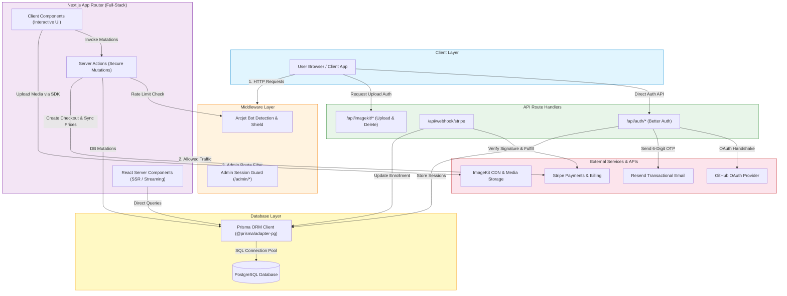
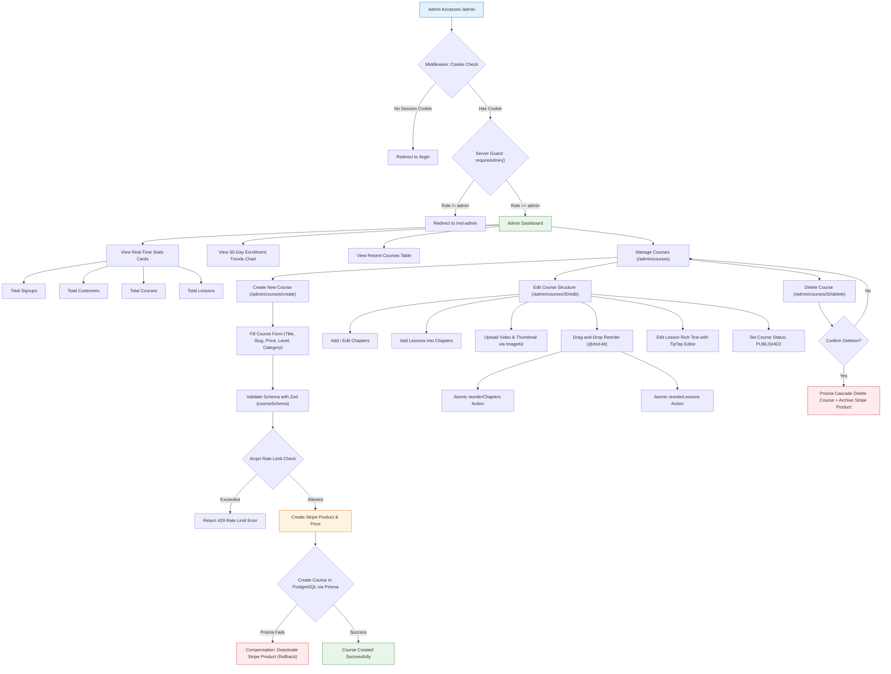
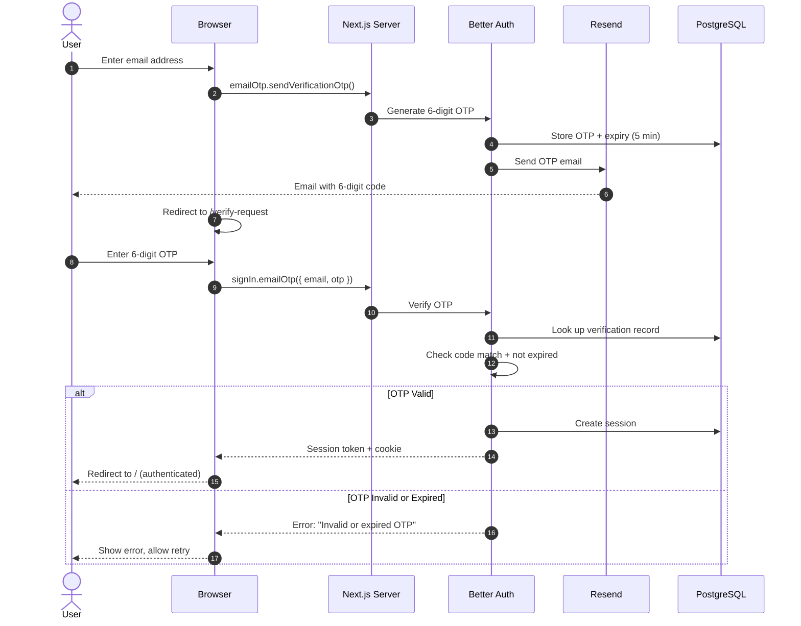
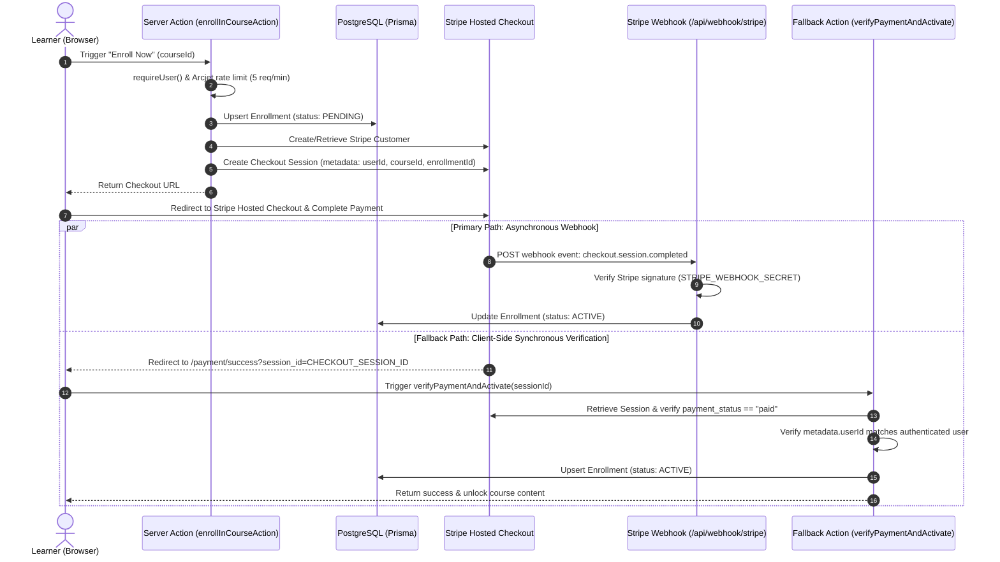
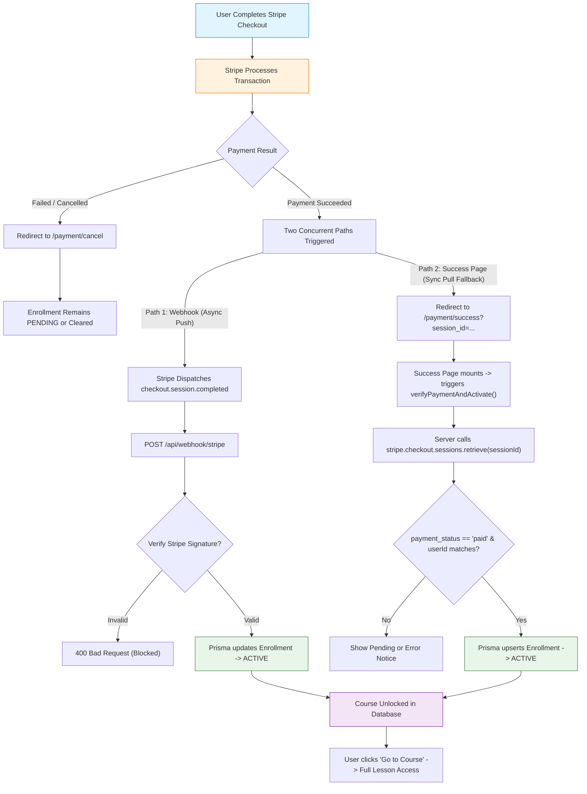
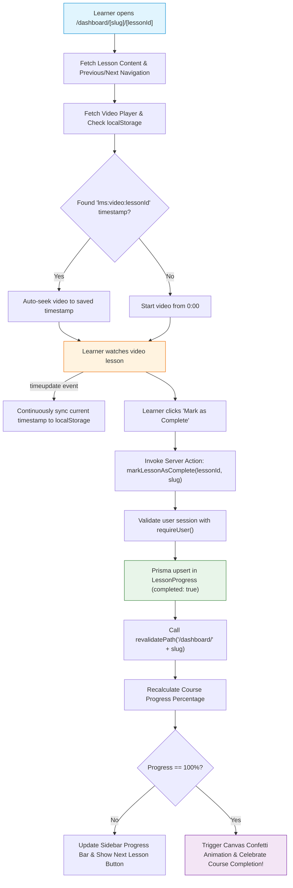
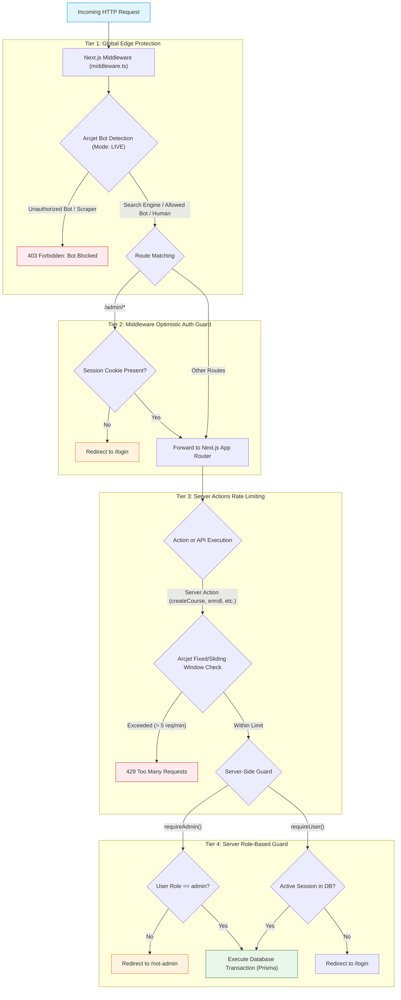
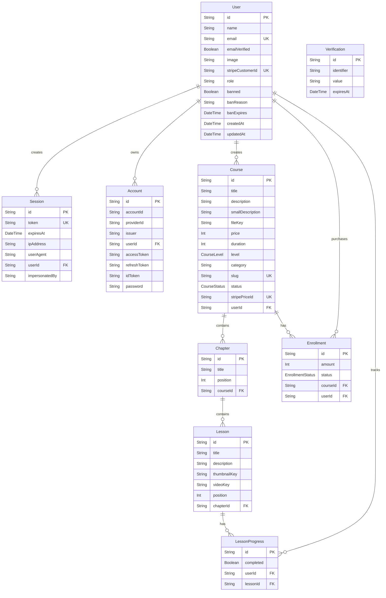

# LMS Course Platform

**A full-stack Learning Management System built with Next.js, Stripe payments, OTP authentication, and admin course management.**

---

## Overview

This is a production-grade LMS platform that enables admins to create, manage, and sell courses, while users can discover, purchase, and learn from structured course content with video lessons and progress tracking.

**Problem it solves:** Provides a self-hosted, full-featured learning platform with integrated payments, authentication, and content management — eliminating the need for third-party LMS SaaS tools.

**Target users:**

- **Students/Learners** — Browse, enroll in, and complete courses
- **Admins/Instructors** — Create courses, manage content, track enrollments

**Key capabilities:**

- Course catalog with search, filtering, and pagination
- Stripe-powered course enrollment and payment
- Email OTP + GitHub OAuth authentication
- Video-based lesson delivery with progress tracking
- Drag-and-drop course structure management
- Admin dashboard with analytics
- Rate limiting and bot protection via Arcjet
- ImageKit-powered media uploads

---

## How It Helps

### Users

- Register/login via GitHub OAuth or email OTP verification
- Browse course catalog with category, level, and sort filters
- View detailed course pages with chapter/lesson outlines
- Enroll via Stripe checkout with instant payment verification
- Access course content with video player and lesson navigation
- Track completion progress across courses and lessons
- Resume video playback from last position

### Admins

- Access protected admin dashboard with stats (signups, customers, courses, lessons)
- Create new courses with Stripe product/price integration
- Edit courses with drag-and-drop chapter and lesson management
- Upload thumbnails and videos via ImageKit
- Publish, archive, or delete courses
- View 30-day enrollment trend chart
- Manage all course content from a single interface

---

## Key Features

| Feature | Implementation |
|---------|---------------|
| Authentication | Better Auth with GitHub OAuth + Email OTP |
| Authorization | Role-based access (user/admin) with session checks |
| OTP Verification | 6-digit code via Resend email, 5-min expiry |
| Course Management | CRUD with chapters, lessons, drag-and-drop reordering |
| Enrollment | Stripe Checkout with webhook + client-side fallback |
| Payment | Stripe one-time purchases with product/price sync |
| Rate Limiting | Arcjet sliding/fixed window on auth, uploads, actions |
| Bot Protection | Arcjet bot detection (allows search engines, blocks others) |
| User Dashboard | Enrolled courses, progress bars, lesson access |
| Admin Dashboard | Stats cards, enrollment chart, recent courses |
| File Uploads | ImageKit drag-and-drop with preview states |
| Rich Text Editor | TipTap for lesson descriptions |
| Theme System | Light/dark/system via next-themes |
| SEO | Dynamic sitemap, robots.txt, OpenGraph metadata |
| Video Resume | localStorage-based position saving per lesson |
| Progress Tracking | Per-lesson completion with course-level aggregation |

---

## Tech Stack

| Category | Technology | Purpose |
|----------|-----------|---------|
| Framework | Next.js 16.3.1 (App Router) | Full-stack React framework |
| Language | TypeScript 5 | Type safety |
| Runtime | React 19.2.8 | UI rendering |
| Database | PostgreSQL | Persistent storage |
| ORM | Prisma 7.9.1 | Database access & migrations |
| Authentication | Better Auth 1.7.1 | Session-based auth with plugins |
| OAuth Provider | GitHub | Social login |
| Email/OTP | Resend 6.22.0 | OTP email delivery |
| Payments | Stripe 22.6.1 | Course purchases |
| Rate Limiting | Arcjet 1.10.0 | Bot detection + rate limits |
| File Storage | ImageKit | Image/video uploads |
| Rich Text | TipTap 3.x | Lesson content editing |
| Forms | React Hook Form + Zod | Form management & validation |
| UI Components | shadcn/ui (base-nova) | Pre-built component library |
| Styling | Tailwind CSS 4 | Utility-first CSS |
| Drag & Drop | @dnd-kit | Chapter/lesson reordering |
| Charts | Recharts 3.8.0 | Enrollment analytics |
| Icons | Lucide + Tabler | Icon libraries |
| Themes | next-themes | Dark/light mode |
| Env Validation | @t3-oss/env-nextjs | Type-safe environment variables |
| Package Manager | Bun 1.3.14 | Fast package installation |
| Build Tool | Next.js (Webpack/Turbopack) | Bundling |
| Compiler | React Compiler (babel-plugin) | Automatic optimization |

---

## System Architecture



**How components interact:**

- **Browser** sends HTTP requests through Next.js middleware first.
- **Middleware** applies global Arcjet bot detection (mode: LIVE), then optimistically validates session cookies on `/admin/*` routes.
- **Server Components (RSC)** fetch data directly from PostgreSQL using Prisma without exposing API endpoints or sending client JavaScript.
- **Client Components** provide rich client interactions (forms, @dnd-kit drag-and-drop, video playback resume, and confetti).
- **Server Actions** handle server mutations protected by per-action Arcjet rate limiting (5 req/min) and session checks.
- **Better Auth API** manages sessions, GitHub OAuth, and Resend email OTP verification with database persistence.
- **Stripe Webhook** receives `checkout.session.completed` events, verifies signature, and flips enrollments to `ACTIVE`.
- **ImageKit API** returns client-side upload authorization tokens and handles authenticated media deletions.

---

## User Flow

```mermaid
flowchart TD
    A["Visit Homepage"] --> B["Browse Course Catalog"]
    B --> C["Search / Filter by Category & Level / Sort"]
    C --> D["View Course Details Page"]
    D --> E{"Click Enroll Now"}

    E --> F{"Authenticated Session?"}
    F -->|"No"| G{"Choose Login Method"}
    F -->|"Yes"| N["Call enrollInCourseAction"]

    G -->|"GitHub"| H["OAuth Redirect & Handshake"]
    G -->|"Email"| I["Enter Email Address"]
    I --> J["Better Auth triggers Resend OTP"]
    J --> K["Enter 6-Digit Code in /verify-request"]
    K --> L{"OTP Valid & Active?"}
    L -->|"No"| K
    L -->|"Yes"| N

    H --> N
    N --> O["Create PENDING Enrollment in DB"]
    O --> P["Stripe Checkout Session Generated"]
    P --> Q["Redirect to Stripe Hosted Checkout"]
    Q --> R{"Complete Payment?"}

    R -->|"Cancelled / Aborted"| S["Redirect to /payment/cancel"]
    S --> B

    R -->|"Payment Succeeded"| T["Redirect to /payment/success"]
    T --> U{"Stripe Webhook Received?"}
    U -->|"Yes: Fast Path"| V["Webhook updates Enrollment to ACTIVE"]
    U -->|"Delayed: Fallback"| W["Client triggers verifyPaymentAndActivate()"]
    W --> V

    V --> X["User Dashboard: Course Unlocked"]
    X --> Y["Open Lesson & Resume Video from localStorage"]
    Y --> Z["Complete Video Lesson"]
    Z --> AA["Click 'Mark as Complete'"]
    AA --> AB["Server Action: markLessonAsComplete()"]
    AB --> AC["Prisma upserts LessonProgress"]
    AC --> AD["Revalidate Path & Recalculate Progress %"]
    AD --> AE{"All Lessons Completed?"}
    AE -->|"No"| Y
    AE -->|"Yes (100%)"| AF["Trigger Canvas Confetti Celebration & Course Completed!"]

    style A fill:#e3f2fd,stroke:#1565c0
    style N fill:#e8f5e9,stroke:#2e7d32
    style P fill:#fff3e0,stroke:#ef6c00
    style V fill:#e8f5e9,stroke:#2e7d32
    style AF fill:#f3e5f5,stroke:#7b1fa2
```



---

## Admin Flow



---

## Authentication & OTP

### Authentication Methods

1. **GitHub OAuth** — One-click social login
2. **Email OTP** — 6-digit code sent via Resend

### OTP Flow



### Session Management

- Sessions stored in PostgreSQL (`Session` model)
- Cookie-based transport via `getSessionCookie()`
- Middleware checks session cookie for admin routes
- `requireUser()` and `requireAdmin()` server-side guards

### Protected Routes

- `/admin/*` — Requires session cookie (middleware) + `role === "admin"` (server)
- `/dashboard/*` — Requires authenticated session
- `/api/imagekit/*` — Requires admin role
- Course enrollment — Requires authenticated user

---

## Payment System & Dual Activation

### Provider: Stripe

The platform employs a **Dual Activation Architecture** to eliminate race conditions and guarantee that users instantly receive course access even if external webhook delivery is delayed or disrupted during local development.

#### Payment Lifecycle (Sequence Diagram)



#### Dual Activation Flowchart



### Payment Details

- **Model:** One-time course purchases
- **Currency:** USD (price stored in cents on Stripe, whole dollars in database)
- **Product Sync:** Admin creates course → Stripe Product + Price created automatically
- **Enrollment States:** `PENDING` → `ACTIVE` (on payment) | `CANCELLED`
- **Dual Activation:** Webhook (primary) + client-side verification (fallback) ensures 100% activation reliability
- **Compensating Rollback:** If Prisma database creation fails after Stripe product creation, the Stripe product is immediately archived/deactivated to prevent orphaned billing items

---

## Video Learning & Progress Flow



---

## Rate Limiting & Security Architecture

### Technology: Arcjet & Next.js Defense-in-Depth

The application implements a multi-tier security lifecycle combining Edge Middleware bot detection, session cookie guards, Server Action throttling, and role-based access control.



### Protected Operations

| Endpoint/Action | Strategy | Limit | Window |
|----------------|----------|-------|--------|
| Auth API (general) | Sliding window | Configured | Configured |
| Signup | Sliding window | 5 requests | 2 minutes |
| ImageKit upload | Fixed window | 5 requests | 1 minute |
| ImageKit delete | Fixed window | 5 requests | 1 minute |
| enrollInCourseAction | Fixed window | 5 requests | 1 minute |
| createCourse | Fixed window | 5 requests | 1 minute |
| editCourse | Fixed window | 5 requests | 1 minute |
| deleteCourse | Fixed window | 5 requests | 1 minute |

### Bot Detection

- Blocks all bots except: search engines, monitors, link previews, Stripe webhooks
- Applied globally via middleware
- Mode: LIVE (blocks requests, not just logging)

### Signup Protection

- Email validation: Blocks disposable emails, invalid formats, domains without MX records
- Rate limit: 5 signups per 2-minute sliding window
- Bot detection: Blocks automated signups

---

## User vs Admin

| Capability | User | Admin |
|-----------|------|-------|
| Browse courses | ✅ | ✅ |
| View course details | ✅ | ✅ |
| Enroll in courses | ✅ | ✅ |
| Access course content | ✅ (enrolled only) | ✅ |
| Track lesson progress | ✅ | ✅ |
| Access user dashboard | ✅ | ✅ |
| Access admin dashboard | ❌ | ✅ |
| Create courses | ❌ | ✅ |
| Edit courses | ❌ | ✅ |
| Delete courses | ❌ | ✅ |
| Manage chapters/lessons | ❌ | ✅ |
| Upload media (ImageKit) | ❌ | ✅ |
| View enrollment stats | ❌ | ✅ |
| View user analytics | ❌ | ✅ |
| Reorder course content | ❌ | ✅ |

---

## Folder Structure
```plaintext
lms-course-platform/
├── .env                          # Environment variables (gitignored)
├── .env.example                  # Environment variable template
├── .gitignore
├── AGENTS.md                     # Agent instructions
├── CLAUDE.md                     # Claude agent config
├── bun.lock                      # Bun lockfile
├── components.json               # shadcn/ui configuration
├── eslint.config.mjs             # ESLint config
├── middleware.ts                  # Arcjet bot detection + admin guard
├── next.config.ts                # Next.js config (React compiler, images, headers)
├── package.json                  # Dependencies and scripts
├── postcss.config.mjs            # PostCSS/Tailwind config
├── prisma.config.ts              # Prisma configuration
├── tsconfig.json                 # TypeScript config
├── prisma/
│   ├── schema.prisma             # Database schema (8 models)
│   └── seed.ts                   # Seed script (Python course data)
├── public/
│   └── *.png, *.svg              # Static assets (logos)
└── src/
    ├── app/
    │   ├── globals.css           # Global styles + shadcn theme
    │   ├── layout.tsx            # Root layout (fonts, providers)
    │   ├── error.tsx             # Global error boundary
    │   ├── not-found.tsx         # 404 page
    │   ├── robots.ts             # SEO: robots.txt
    │   ├── sitemap.ts            # SEO: dynamic sitemap
    │   ├── (auth)/               # Auth route group
    │   │   ├── layout.tsx        # Auth layout (centered card)
    │   │   ├── login/            # Login page + OAuth/OTP
    │   │   └── verify-request/   # OTP verification page
    │   ├── (public)/             # Public route group
    │   │   ├── layout.tsx        # Public layout (navbar)
    │   │   ├── page.tsx          # Homepage (hero + features)
    │   │   └── courses/          # Course catalog + detail pages
    │   ├── dashboard/            # User dashboard
    │   │   ├── layout.tsx        # Dashboard layout (sidebar)
    │   │   ├── page.tsx          # Enrolled + available courses
    │   │   └── [slug]/           # Course content + video lesson pages
    │   ├── admin/                # Admin panel
    │   │   ├── layout.tsx        # Admin layout (auth guard)
    │   │   ├── page.tsx          # Dashboard (stats, chart)
    │   │   └── courses/          # Course CRUD + drag-drop structure editor
    │   ├── not-admin/            # Access forbidden page for non-admin users
    │   ├── payment/              # Payment pages
    │   │   ├── success/          # Success page + verification fallback
    │   │   └── cancel/           # Cancelled page
    │   ├── data/                 # Server-Side Data Access Layer (DAL)
    │   │   ├── admin/            # Admin stats, courses, lessons & requireAdmin
    │   │   ├── course/           # Catalog, course detail, lessons & sidebar data
    │   │   └── user/             # Enrolled courses, enrollment checks & requireUser
    │   └── api/
    │       ├── auth/[...all]/    # Better Auth catch-all
    │       ├── webhook/stripe/   # Stripe webhook handler
    │       └── imagekit/         # Upload + delete endpoints
    ├── components/
    │   ├── theme-provider.tsx    # Theme context provider
    │   ├── general/              # Reusable components
    │   ├── file-uploader/        # ImageKit drag-and-drop
    │   ├── rich-text-editor/     # TipTap editor + renderer
    │   ├── sidebar-ui/           # Admin sidebar + header
    │   └── ui/                   # shadcn/ui components (30+)
    ├── hooks/                    # Custom React hooks
    ├── lib/
    │   ├── auth.ts               # Better Auth server config
    │   ├── auth-client.ts        # Better Auth client config
    │   ├── db.ts                 # Prisma client singleton
    │   ├── stripe.ts             # Stripe client
    │   ├── resend.ts             # Resend email client
    │   ├── arcjet.ts             # Arcjet rate limiting config
    │   ├── env.ts                # t3-env validated env vars
    │   ├── utils.ts              # Utility functions
    │   └── zodSchema.ts          # Zod validation schemas
    └── generated/prisma/         # Generated Prisma client
```

### Important Files

| Path | Purpose |
|------|---------|
| `middleware.ts` | Global bot detection + admin session guard |
| `src/lib/auth.ts` | Better Auth config (GitHub + OTP + Admin plugin) |
| `src/lib/arcjet.ts` | Rate limiting and bot detection rules |
| `src/lib/db.ts` | Prisma client singleton with PostgreSQL adapter |
| `src/lib/env.ts` | Type-safe environment variable validation |
| `prisma/schema.prisma` | Complete database schema |
| `src/app/api/webhook/stripe/route.ts` | Stripe payment webhook |
| `src/app/api/auth/[...all]/route.ts` | Auth API handler |
| `src/app/admin/courses/create/action.ts` | Course creation + Stripe sync |
| `src/app/(public)/courses/[slug]/action.ts` | Enrollment checkout action |

---

## Database Architecture

### Models



### Relationships

- **User → Course** — One user creates many courses (admin)
- **User → Enrollment** — One user has many enrollments
- **Course → Chapter** — One course has many chapters (ordered by position)
- **Chapter → Lesson** — One chapter has many lessons (ordered by position)
- **Course ↔ User (Enrollment)** — Many-to-many via Enrollment join table
- **User ↔ Lesson (Progress)** — Many-to-many via LessonProgress join table

### Enums

- `CourseLevel`: BEGINNER, INTERMEDIATE, ADVANCED
- `CourseStatus`: DRAFT, PUBLISHED, ARCHIVED
- `EnrollmentStatus`: PENDING, ACTIVE, CANCELLED

---

## API / Server Architecture

### API Routes

| Method | Endpoint | Purpose | Auth |
|--------|----------|---------|------|
| `*` | `/api/auth/[...all]` | Better Auth catch-all handler | Public |
| `POST` | `/api/webhook/stripe` | Stripe webhook (payment events) | Stripe signature |
| `POST` | `/api/imagekit/upload` | ImageKit upload authentication | Admin |
| `DELETE` | `/api/imagekit/delete` | ImageKit file deletion | Admin |

### Server Actions

| Action | Location | Purpose | Auth |
|--------|----------|---------|------|
| `enrollInCourseAction` | `(public)/courses/[slug]/action.ts` | Create Stripe checkout session | User |
| `verifyPaymentAndActivate` | `payment/success/action.ts` | Fallback enrollment activation | User |
| `markLessonAsComplete` | `dashboard/[slug]/[lessonId]/action.ts` | Mark lesson completed | User |
| `createCourse` | `admin/courses/create/action.ts` | Create course + Stripe product | Admin |
| `editCourse` | `admin/courses/[courseId]/edit/action.ts` | Update course details | Admin |
| `createChapter` | `admin/courses/[courseId]/edit/action.ts` | Add chapter to course | Admin |
| `createLesson` | `admin/courses/[courseId]/edit/action.ts` | Add lesson to chapter | Admin |
| `deleteLesson` | `admin/courses/[courseId]/edit/action.ts` | Remove lesson + reindex | Admin |
| `deleteChapter` | `admin/courses/[courseId]/edit/action.ts` | Remove chapter + reindex | Admin |
| `reorderLessons` | `admin/courses/[courseId]/edit/action.ts` | Drag-and-drop reorder | Admin |
| `reorderChapters` | `admin/courses/[courseId]/edit/action.ts` | Drag-and-drop reorder | Admin |
| `updateLesson` | `admin/courses/[courseId]/[chapterId]/[lessonId]/action.ts` | Update lesson content | Admin |
| `deleteCourse` | `admin/courses/[courseId]/delete/action.ts` | Delete course + Stripe product | Admin |

### Data Access Layer

| Function | Location | Purpose |
|----------|----------|---------|
| `requireUser()` | `src/app/data/user/require-user.ts` | Server auth guard (redirects unauthenticated users to `/login`) |
| `requireAdmin()` | `src/app/data/admin/require-admin.ts` | Server admin guard (redirects non-admins to `/not-admin`) |
| `getAdminSession()` | `src/app/data/admin/require-admin.ts` | Returns active admin session or `null` for API protection |
| `checkIfCourseBought()` | `src/app/data/user/user-is-enrolled.ts` | Verifies active enrollment before unlocking lessons |
| `getEnrolledCourses()` | `src/app/data/user/get-enrolled-courses.ts` | Fetches courses enrolled by current user with progress % |
| `getAllCourses()` | `src/app/data/course/get-all-courses.ts` | Public course catalog with category, search, and pagination |
| `getAllCourse()` | `src/app/data/course/get-all-course.ts` | Single course by slug for public preview and outlines |
| `getCourseSidebarData()` | `src/app/data/course/get-course-sidebar-data.ts` | Chapters & lessons with progress status for learner sidebar |
| `getLessonContent()` | `src/app/data/course/get-lesson-content.ts` | Lesson details, video player keys, and prev/next links |
| `adminGetCourses()` | `src/app/data/admin/admin-get-courses.ts` | All courses with enrollment counts for admin list view |
| `adminGetCourse()` | `src/app/data/admin/admin-get-course.ts` | Full course details with chapters & lessons for admin editing |
| `adminGetLesson()` | `src/app/data/admin/admin-get-lesson.ts` | Single lesson data for admin lesson editing modal/page |
| `adminGetRecentCourses()` | `src/app/data/admin/admin-get-recent-courses.ts` | Latest courses displayed on admin dashboard overview |
| `adminGetDashboardStats()` | `src/app/data/admin/admin-get-dashboard-stats.ts` | Aggregate counts: signups, customers, courses, and lessons |
| `adminGetEnrollmentStats()` | `src/app/data/admin/admin-get-enrollment-stats.ts` | 30-day enrollment volume trend for Recharts visualization |

---

## Security

### Authentication

- **Better Auth** with database-backed sessions (not JWT)
- **GitHub OAuth** for social login
- **Email OTP** with 6-digit codes, 5-minute expiry, single-use
- Session tokens stored in HTTP-only cookies

### Authorization

- **Role-based access control** — `role` field on User model
- **Middleware guard** — Checks session cookie for `/admin/*` routes
- **Server-side guards** — `requireUser()` and `requireAdmin()` with redirects
- **Component-level** — Admin layout wraps all admin pages

### Rate Limiting (Arcjet)

- **Signup protection** — 5 requests / 2 minutes (sliding window)
- **API protection** — Rate limiting on auth endpoints
- **Action protection** — Fixed window on all server actions (5 req/min)
- **Upload protection** — Rate limiting on ImageKit endpoints (5 req/min)
- **Bot detection** — Blocks non-search-engine bots globally

### Input Validation

- **Zod schemas** for course, chapter, and lesson validation
- **@t3-oss/env-nextjs** for type-safe environment variables
- **Better Auth email validation** — Blocks disposable emails, invalid formats, missing MX records

### Payment Security

- **Stripe webhook signature verification** — Validates webhook authenticity
- **Server-side payment verification** — Fallback uses Stripe API to verify session
- **Enrollment tied to user** — Cannot enroll others

### Other Security

- **Security headers** in `next.config.ts`:
  - `X-Content-Type-Options: nosniff`
  - `Referrer-Policy: strict-origin-when-cross-origin`
  - `X-Frame-Options: SAMEORIGIN`
- **Environment variables** — All secrets in `.env` (gitignored), validated at build time
- **Prisma parameterized queries** — SQL injection prevention
- **Cascade deletes** — Orphaned records cleaned up automatically

---

## Business Model

### Revenue Model

- **One-time course purchases** — Admin sets price per course
- **Stripe as payment processor** — Handles checkout, refunds, disputes
- **No subscription model** — Each course is a separate purchase

### Platform Flow

1. **Admin creates course** → Stripe Product + Price auto-created
2. **User enrolls** → Stripe Checkout Session created
3. **Payment completes** → Enrollment activated via webhook
4. **Course access granted** → User can watch all lessons

### Pricing

- Price set per course (integer in dollars, converted to cents for Stripe)
- No platform commission logic implemented (direct Stripe transfers)
- No instructor revenue splitting

---

## User Journey

1. **Discover** — User visits homepage, clicks "Browse Courses"
2. **Browse** — Searches by keyword, filters by category/level, sorts results
3. **Evaluate** — Views course detail page (description, chapters, lessons, price)
4. **Register** — Signs up via GitHub OAuth or email OTP
5. **Purchase** — Clicks "Enroll Now", redirected to Stripe Checkout
6. **Pay** — Completes payment on Stripe
7. **Verify** — Payment verified via webhook (or fallback on success page)
8. **Access** — Course appears in dashboard with progress tracking
9. **Learn** — Watches video lessons, marks completion
10. **Track** — Progress bar shows course completion percentage

---

## Admin Journey

1. **Login** — Signs in with admin credentials
2. **Dashboard** — Views stats (signups, customers, courses, lessons) + enrollment chart
3. **Create Course** — Fills form (title, slug, description, category, level, price, duration)
4. **Stripe Sync** — Course automatically creates Stripe Product + Price
5. **Add Structure** — Creates chapters, then adds lessons to each chapter
6. **Upload Media** — Drags and drops thumbnails and video files via ImageKit
7. **Edit Content** — Uses rich text editor for lesson descriptions
8. **Reorder** — Drag-and-drop to rearrange chapters and lessons
9. **Publish** — Sets course status to PUBLISHED
10. **Monitor** — Tracks enrollments via dashboard chart

---

## Environment Variables

| Variable | Purpose | Required |
|----------|---------|----------|
| `DATABASE_URL` | PostgreSQL connection string | ✅ |
| `BETTER_AUTH_SECRET` | Better Auth encryption secret | ✅ |
| `BETTER_AUTH_URL` | Application base URL | ✅ |
| `AUTH_GITHUB_CLIENT_ID` | GitHub OAuth client ID | ✅ |
| `AUTH_GITHUB_CLIENT_SECRET_ID` | GitHub OAuth client secret | ✅ |
| `RESEND_API_KEY` | Resend email API key | ✅ |
| `ARCJET_KEY` | Arcjet API key | ✅ |
| `ARCJET_ENV` | Arcjet environment (development/production) | ✅ |
| `IMAGEKIT_PRIVATE_KEY` | ImageKit private key | ✅ |
| `NEXT_PUBLIC_IMAGEKIT_PUBLIC_KEY` | ImageKit public key | ✅ |
| `NEXT_PUBLIC_IMAGEKIT_URL_ENDPOINT` | ImageKit CDN URL endpoint | ✅ |
| `STRIPE_SECRET_KEY` | Stripe secret key | ✅ |
| `STRIPE_WEBHOOK_SECRET` | Stripe webhook signing secret | ✅ |

---

## Local Setup

### Prerequisites

- Node.js 18+ (or Bun)
- PostgreSQL database
- Stripe account (test mode)
- Resend account (for OTP emails)
- GitHub OAuth app (for social login)
- ImageKit account (for media uploads)
- Arcjet account (for rate limiting)

### Installation

```bash
# Clone the repository
git clone https://github.com/your-username/lms-course-platform.git
cd lms-course-platform

# Install dependencies
bun install

# Copy environment template
cp .env.example .env

# Fill in your environment variables in .env
```

### Database Setup

```bash
# Generate Prisma client
bunx prisma generate

# Run database migrations
bunx prisma db push

# Seed sample data (optional)
bun run db:seed
```

### Development Server

```bash
# Start development server
bun run dev
```

Visit [http://localhost:3000](http://localhost:3000)

### Build & Production

```bash
# Build for production
bun run build

# Start production server
bun run start
```

### Stripe Webhook (for local development)

```bash
# Install Stripe CLI
# Login to Stripe
stripe login

# Forward webhooks to local server
stripe listen --forward-to localhost:3000/api/webhook/stripe
```

---

## Deployment

### Recommended Platform: Vercel

```bash
# Install Vercel CLI
npm i -g vercel

# Deploy
vercel
```

### Deployment Checklist

| Item | Details |
|------|---------|
| **Build Command** | `next build` |
| **Start Command** | `next start` |
| **Node Version** | 18+ |
| **Package Manager** | Bun |
| **Database** | PostgreSQL (Vercel Postgres, Supabase, or Neon) |
| **Environment Variables** | Set all variables in hosting dashboard |
| **Stripe Webhooks** | Point to `your-domain.com/api/webhook/stripe` |
| **Domain** | Configure custom domain in Vercel |

### Production Considerations

- Set `ARCJET_ENV=production` and use production Arcjet key
- Use production Stripe keys and webhook secrets
- Configure Resend for production email delivery
- Set `BETTER_AUTH_URL` to your production domain
- Ensure ImageKit endpoint is configured for production

---

## Error Handling

| Error Type | Handling |
|-----------|----------|
| **Auth errors** | Better Auth returns structured errors; UI shows toast via `sonner` |
| **OTP errors** | Invalid/expired OTP returns error; user prompted to retry |
| **Unauthorized access** | `requireUser()` redirects to `/login`; `requireAdmin()` redirects to `/not-admin` |
| **Rate limits** | Arcjet returns 429; client receives rate limit error |
| **Payment failures** | Stripe Checkout handles errors; cancel page shown on abort |
| **Validation errors** | Zod schemas validate inputs; errors displayed in form UI |
| **Database errors** | Prisma throws on constraint violations; caught in try/catch |
| **Global errors** | `error.tsx` boundary catches unhandled errors |
| **Not found** | `not-found.tsx` renders 404 page |
| **Upload errors** | ImageKit uploader shows error state via `RenderState` component |

---

## Design Decisions

| Decision | Rationale |
|----------|-----------|
| **Next.js App Router** | Server Components by default reduce client JS; Server Actions simplify mutations |
| **Better Auth over NextAuth** | Lightweight, plugin-based (OTP, Admin), database sessions, no JWT complexity |
| **Prisma over Drizzle** | Mature ecosystem, type-safe queries, migration system, Prisma Studio for debugging |
| **Stripe over LemonSqueezy** | Industry standard, webhook infrastructure, extensive API, test mode |
| **Arcjet over UpStash** | Built-in bot detection + rate limiting + email validation in one SDK |
| **ImageKit over S3** | Built-in CDN, image optimization, drag-and-drop uploads, no S3 config |
| **Server Actions over API Routes** | Type safety, no manual fetch, progressive enhancement, co-located with components |
| **shadcn/ui over component libraries** | Own the code, no dependency lock-in, customizable, Tailwind-native |
| **Route Groups** | Clean URL structure while maintaining separate layouts for auth, public, dashboard |
| **Dual payment activation** | Webhook (async) + client-side fallback (sync) ensures enrollment activation |
| **Database sessions over JWT** | Revocable, server-controlled, no token refresh logic needed |

---

## Scalability

### Current

- PostgreSQL with indexed queries (user lookups, enrollment checks)
- Prisma connection pooling via `@prisma/adapter-pg`
- ImageKit CDN for media delivery
- Server Components reduce client bundle size
- Pagination on course catalog (9 per page)
- Database indexes on foreign keys and unique constraints

### Future Improvements

- **Redis/Cache** — Cache popular courses, session data, rate limit counters
- **CDN** — Vercel Edge Network or Cloudflare for static assets
- **Background Jobs** — Queue email notifications, enrollment confirmations, webhook retries
- **Database Scaling** — Read replicas, connection pooling (PgBouncer), connection limits
- **Load Balancing** — Multi-region deployment for global access
- **Object Storage** — S3-compatible storage for large video files (replace ImageKit for videos)
- **Monitoring** — Sentry for error tracking, APM for performance, logging aggregation

---

## Performance

### Implemented

- **React Server Components** — Zero client JS for data-fetching pages
- **React Compiler** — Automatic memoization and optimization
- **Server Components** — Pages like course catalog, admin dashboard, lesson content render on server
- **Pagination** — Course catalog limited to 9 courses per page
- **Prisma Indexing** — Indexes on `userId`, `token`, `identifier` for fast lookups
- **ImageKit CDN** — Images served from edge locations with automatic optimization
- **Lazy Loading** — Client components loaded on demand
- **Suspense Boundaries** — Loading skeletons while data fetches
- **Optimistic UI** — `useOptimistic` for instant filter feedback in course catalog
- **Video Resume** — localStorage-based position saving avoids re-downloading
- **Security Headers** — Minimal overhead, applied at middleware level

---

## Testing

Automated testing is not currently implemented in this project. The following testing approaches can be added:

- **Unit Tests** — Jest/Vitest for utility functions, Zod schemas, data access functions
- **Component Tests** — React Testing Library for UI components
- **E2E Tests** — Playwright or Cypress for critical flows (auth, enrollment, payment)
- **API Tests** — Integration tests for server actions and webhook handlers

---

## Feature Matrix

| Feature | Status |
|---------|--------|
| GitHub OAuth Login | ✅ Implemented |
| Email OTP Authentication | ✅ Implemented |
| Role-based Authorization | ✅ Implemented |
| Course Catalog (search, filter, paginate) | ✅ Implemented |
| Course Detail Pages | ✅ Implemented |
| Stripe Checkout Enrollment | ✅ Implemented |
| Stripe Webhook Processing | ✅ Implemented |
| Payment Fallback Verification | ✅ Implemented |
| User Dashboard | ✅ Implemented |
| Video Lesson Player | ✅ Implemented |
| Lesson Progress Tracking | ✅ Implemented |
| Course Progress Calculation | ✅ Implemented |
| Video Resume (position saving) | ✅ Implemented |
| Admin Dashboard (stats + chart) | ✅ Implemented |
| Course CRUD (create, edit, delete) | ✅ Implemented |
| Chapter/Lesson Management | ✅ Implemented |
| Drag-and-drop Reordering | ✅ Implemented |
| ImageKit Media Uploads | ✅ Implemented |
| Rich Text Editor (TipTap) | ✅ Implemented |
| Rate Limiting (Arcjet) | ✅ Implemented |
| Bot Detection | ✅ Implemented |
| Signup Protection | ✅ Implemented |
| Dark/Light Theme | ✅ Implemented |
| SEO (sitemap, robots) | ✅ Implemented |
| Security Headers | ✅ Implemented |
| Type-safe Environment Variables | ✅ Implemented |
| Instructor Portal | ❌ Not implemented |
| Course Reviews/Ratings | ❌ Not implemented |
| Certificates | ❌ Not implemented |
| Notifications (email/push) | ❌ Not implemented |
| Course Analytics | ❌ Not implemented |
| Subscription Model | ❌ Not implemented |
| Multi-instructor Support | ❌ Not implemented |
| Discussion/Q&A | ❌ Not implemented |
| Automated Testing | ❌ Not implemented |
| Background Jobs/Queues | ❌ Not implemented |

---

## Current Limitations

- **No automated tests** — No unit, integration, or E2E tests
- **No instructor portal** — Only admin role; no multi-instructor support
- **No course reviews or ratings** — No social proof mechanism
- **No certificates** — No completion certificates
- **No notifications** — No email/push notifications for enrollment, progress, or updates
- **No subscription model** — Only one-time purchases
- **No discussion/Q&A** — No community features
- **Video hosting** — Relies on ImageKit for video storage; no dedicated video CDN
- **No bulk operations** — Admin must manage courses one at a time
- **No analytics** — No detailed course/user analytics beyond basic stats
- **No refund handling** — Stripe refunds handled manually in Stripe dashboard
- **Single currency** — USD only

---

## Future Improvement

- [ ] **Instructor Portal** — Multi-instructor registration, course creation, revenue sharing
- [ ] **Course Reviews & Ratings** — Star ratings, written reviews, social proof
- [ ] **Completion Certificates** — PDF certificates with name, course, date
- [ ] **Email Notifications** — Enrollment confirmations, progress reminders, course updates
- [ ] **Push Notifications** — Real-time updates via web push
- [ ] **Course Analytics** — Enrollment trends, completion rates, revenue reports
- [ ] **AI Tutor** — AI-powered course assistant for Q&A
- [ ] **RAG Course Assistant** — Retrieval-augmented generation for course-specific help
- [ ] **Mobile App** — React Native or Flutter companion app
- [ ] **Redis/Cache** — Cache popular courses, session data, rate limit counters
- [ ] **Background Jobs** — BullMQ/Inngest for async tasks (email, webhooks, analytics)
- [ ] **Automated Testing** — Unit, integration, and E2E test suite
- [ ] **Multi-language Support** — Internationalization (i18n)
- [ ] **Course Bundles** — Group courses at a discount
- [ ] **Affiliate System** — Referral tracking and commission
- [ ] **Community Features** — Discussion forums, study groups
- [ ] **Live Classes** — Webinar/live session integration
- [ ] **Downloadable Resources** — PDFs, code files, supplementary materials
- [ ] **Progress Reminders** — Email nudges for inactive users
- [ ] **Admin Roles** — Granular permissions (editor, instructor, super-admin)

---

## Learning Outcomes

This project demonstrates:

- **Full-Stack Development** — End-to-end application with server and client code
- **Modern React Patterns** — Server Components, Server Actions, hooks, optimistic UI
- **Authentication** — OAuth + OTP with session management
- **Authorization** — Role-based access control with middleware and server guards
- **Database Design** — Relational schema with proper normalization and constraints
- **ORM Usage** — Prisma with PostgreSQL, migrations, relations, aggregations
- **Payment Integration** — Stripe Checkout, webhooks, product/price sync
- **Email Integration** — Resend for transactional OTP emails
- **Rate Limiting** — Arcjet for bot detection, signup protection, action throttling
- **File Uploads** — ImageKit integration with drag-and-drop UI
- **Rich Text Editing** — TipTap editor with custom toolbar
- **Drag & Drop** — @dnd-kit for sortable course structure
- **UI/UX Design** — shadcn/ui + Tailwind CSS, dark/light themes, responsive layouts
- **API Design** — RESTful API routes + server actions pattern
- **Security** — Input validation, CSRF protection, security headers, webhook verification
- **SEO** — Dynamic sitemap, robots.txt, metadata
- **System Design** — Clean architecture with separated concerns (data, components, actions)
- **TypeScript** — End-to-end type safety from database to UI

---

## Technical Challenges & Solutions

### 1. Dual Payment Activation

**Challenge:** Webhooks can fail or be delayed, leaving enrollments stuck in PENDING state.
**Solution:** Implemented two activation paths — primary webhook handler + client-side fallback on the success page that manually verifies the Stripe session.
**Result:** Robust enrollment activation that works even if webhooks fail.

### 2. Admin Authorization

**Challenge:** Need to protect admin routes at both middleware and server level.
**Solution:** Middleware checks session cookie for `/admin/*` routes; `requireAdmin()` server function checks `role === "admin"` and redirects to `/not-admin`.
**Result:** Defense-in-depth authorization with graceful error pages.

### 3. Course Structure Reordering

**Challenge:** Admins need to visually reorder chapters and lessons.
**Solution:** @dnd-kit with custom position tracking; server action updates all affected positions atomically; Prisma transactions ensure consistency.
**Result:** Smooth drag-and-drop with instant UI feedback and persistent ordering.

### 4. Signup Spam Prevention

**Challenge:** Prevent automated account creation via bot scripts.
**Solution:** Arcjet signup protection combines email validation (disposable email blocking, MX record checks), bot detection, and rate limiting (5 signups per 2 minutes).
**Result:** Multi-layered defense against automated abuse.

### 5. Stripe Product Sync

**Challenge:** Keep Stripe products in sync with course data.
**Solution:** Course creation triggers Stripe Product + Price creation; if Prisma save fails, the Stripe product is deactivated (compensation pattern); course edit can update Stripe prices.
**Result:** Consistent payment data between platform and Stripe.

### 6. Video Playback Resume

**Challenge:** Users lose their position when navigating away from a lesson.
**Solution:** localStorage-based position saving per lesson (`lms:video:{lessonId}`); position restored on mount.
**Result:** Seamless video resume without additional database overhead.

---

## Interview Talking Points

1. **Why Better Auth over NextAuth?** — Plugin architecture (OTP, Admin), database sessions, lightweight, no JWT complexity.

2. **How does the OTP flow work?** — Email OTP via Resend, 6-digit code, 5-minute expiry, Better Auth plugin handles generation/verification.

3. **Explain the payment flow** — User clicks enroll → Server action creates Stripe Checkout → User pays → Webhook activates enrollment (with client-side fallback).

4. **Why Arcjet over UpStash?** — Single SDK for bot detection, rate limiting, email validation; no separate Redis infrastructure needed.

5. **How is authorization enforced?** — Three layers: middleware (session check), server guards (`requireAdmin()`), and component-level (admin layout wrapper).

6. **Why Server Actions over API routes?** — Type safety (end-to-end), no manual fetch, progressive enhancement, co-located with components.

7. **How does the dual payment activation work?** — Webhook handles `checkout.session.completed` events; success page has fallback that verifies session with Stripe API.

8. **Explain the course structure model** — Course → Chapters (ordered) → Lessons (ordered); position field enables drag-and-drop reordering.

9. **How is rate limiting configured?** — Per-endpoint: signup (5/2min sliding), actions (5/1min fixed), uploads (5/1min fixed), all via Arcjet.

10. **What happens if Stripe webhook fails?** — Client-side fallback on `/payment/success` page calls `verifyPaymentAndActivate()` which manually verifies with Stripe API.

11. **How does the enrollment access control work?** — `checkIfCourseBought()` verifies enrollment status before serving course content; unauthorized users redirected.

12. **Explain the database session model** — Sessions stored in PostgreSQL with token, expiry, user agent; Better Auth manages cookie transport and validation.

13. **How does the admin dashboard get stats?** — Server queries aggregate counts (signups, customers, courses, lessons) and 30-day enrollment data for chart visualization.

14. **What security headers are set?** — `X-Content-Type-Options: nosniff`, `Referrer-Policy: strict-origin-when-cross-origin`, `X-Frame-Options: SAMEORIGIN`.

15. **How would you scale this?** — Redis caching, read replicas, background jobs for emails, CDN for assets, video CDN migration, load balancing.

---

## Project Statistics

| Metric | Count |
|--------|-------|
| Pages/Routes | 18 |
| API Routes | 4 |
| Server Actions | 13 |
| Database Models | 8 |
| Database Enums | 3 |
| UI Components | 30+ (shadcn/ui) |
| Custom Components | 15+ |
| Custom Hooks | 6 |
| Lib Modules | 9 |
| Data Access Functions | 14 |
| Rate-limited Endpoints | 7 |

---

## License

This project is licensed under the [MIT License](LICENSE) — see the [LICENSE](LICENSE) file for details.

---

## Author

**Suraj Gupta**

- **GitHub:** [@surajgupta001](https://github.com/surajgupta001)
- **Email:** [surajgupta7070031833@gmail.com](mailto:surajgupta7070031833@gmail.com)
- **Repository:** [lms-course-platform](https://github.com/surajgupta001/lms-course-platform)

---

**Built with Next.js 16, Prisma, Stripe, Better Auth, Arcjet, and shadcn/ui.**
