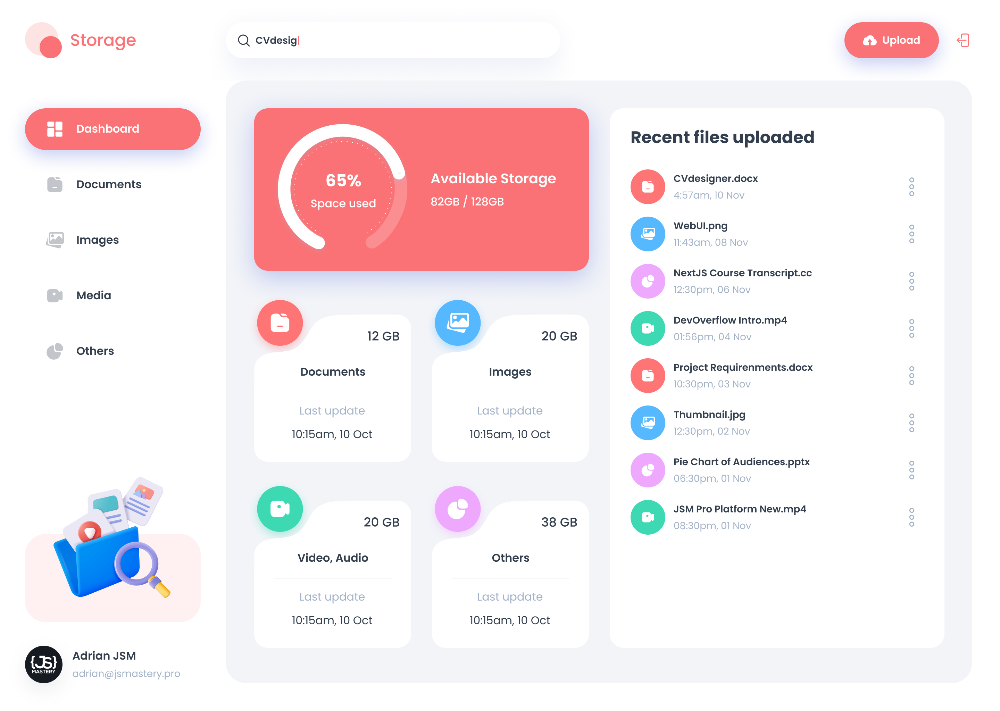
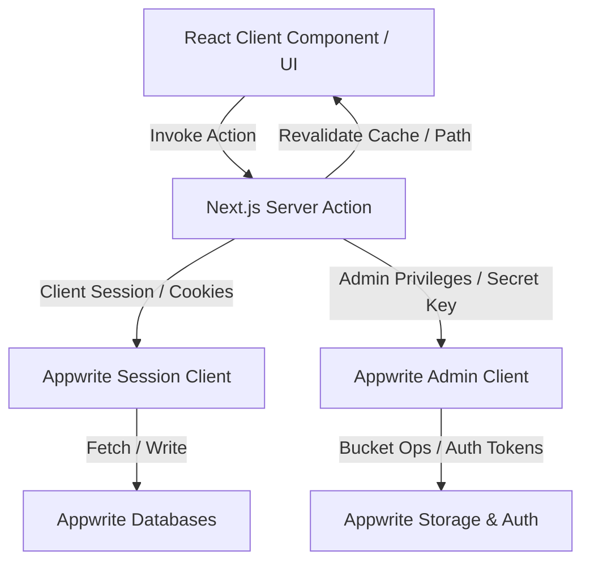
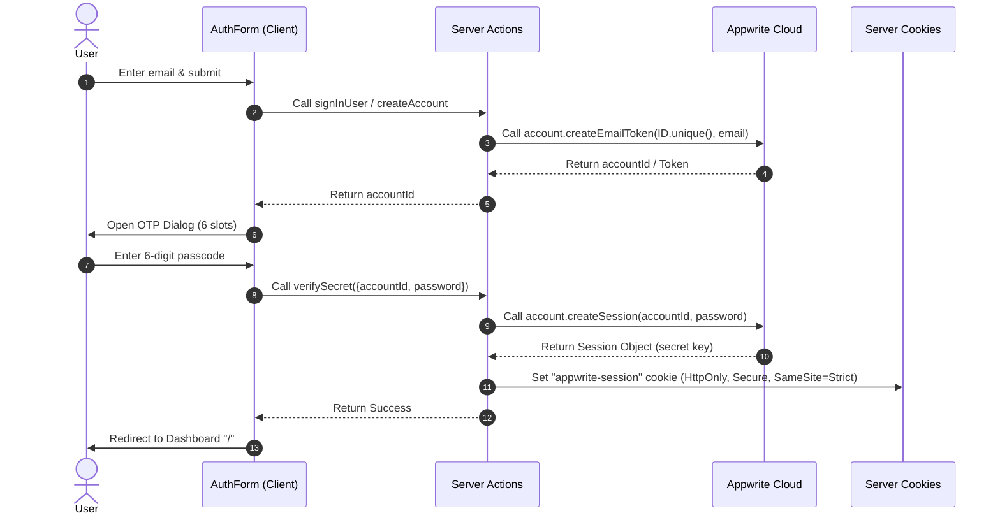
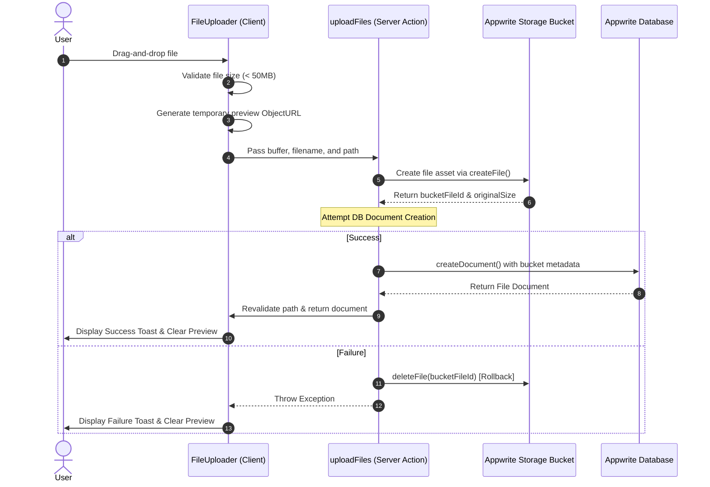

# Storage Hub - Modern Cloud Storage Platform

[](https://nextjs.org/)
[](https://tailwindcss.com/)
[](https://appwrite.io/)

**🔗 Live Website URL:** [https://storage-hub-navy.vercel.app/](https://storage-hub-navy.vercel.app/)

A premium, state-of-the-art secure cloud storage platform built using Next.js 16, Appwrite Cloud, Tailwind CSS v4, and Shadcn UI. Storage Hub offers users a secure workspace to upload, view, manage, organize, and share documents, images, video/audio media, and miscellaneous files.

---

## 📸 Project Previews

### 1. Dashboard Overview


### 2. Multi-Format File Uploading


### 3. Collaboration & Sharing Dialog


---

## 🚀 Key Features

*   **Passwordless Authentication**: Zero password retention. Secured via Appwrite's email OTP (One-Time Password) login with strict secure cookies.
*   **Unified Multi-Format Uploader**: Instant drag-and-drop file uploader supporting file types up to 50MB with background progress toasts.
*   **Dynamic Visual Dashboard**: Real-time storage consumption donut charts, total space usage summaries, and modern grid cards.
*   **Dynamic File Sorting and Filtering**: Sort by name, date created, size, and search with responsive queries across sub-categories: Documents, Images, Media, and Others.
*   **Collaboration & Sharing**: Granular document sharing allowing multiple users (by email address) to read and access shared files.
*   **File Management Actions**: Comprehensive actions including details inspector, file downloading, renaming, and secure deletion from Appwrite storage bucket.

---

## 🛠️ Complete Tech Stack

| Technology | Role | Rationale / Why It Was Chosen |
| :--- | :--- | :--- |
| **Next.js 16** | Core Framework | Enables React Server Components (RSC) to securely fetch data on the server, React 19 concurrent features, Turbopack compilation, and React Compiler optimizations. |
| **Appwrite Cloud** | Backend-as-a-Service | Provides secure authentication (email tokens), robust NoSQL database collections, and cloud storage buckets out-of-the-box with fine-grained access control. |
| **Tailwind CSS v4** | UI Styling | Standard styling engine leveraging compile-time performance optimizations, modern HSL custom variables, glassmorphism, and responsive screen-size modifiers. |
| **React Hook Form & Zod** | Form Validation | Provides strict schema-driven client validation for email fields and file names, preventing unvalidated inputs from reaching the server actions. |
| **Shadcn UI** | Component Foundation | Pre-styled, accessible headless Radix primitives that deliver a premium, theme-aware layout (Dialogs, Dropdowns, OTP inputs). |
| **Recharts** | Data Visualization | Renders dynamic circular charts showing exact storage percentages for different file types. |

---

## 🧱 System Architecture

The application is designed using a server-first architecture. React Client Components dispatch actions directly to Next.js Server Actions, which communicate with Appwrite's Cloud Services using the server-side SDK.



---

## 📁 Folder and File Structure Breakdown

```
storage-hub/
├── constants/
│   └── index.ts                 # Navigation configs, dropdown action types, and file constants
├── types/
│   └── index.d.ts               # Global TypeScript interfaces for files, users, and API props
├── public/
│   └── assets/                  # SVG icons, logo assets, and layout illustration graphics
└── src/
    ├── app/                     # Next.js App Router Structure
    │   ├── globals.css          # Tailwind CSS v4 directives, custom theme properties, animations
    │   ├── layout.tsx           # Base RootLayout loading Google Fonts (Geist, Poppins)
    │   ├── (auth)/              # Authentication routing group
    │   │   ├── layout.tsx       # Auth visual layout showing branding banners
    │   │   ├── sign-in/         # Login route (renders AuthForm)
    │   │   └── sign-up/         # Account creation route (renders AuthForm)
    │   └── (root)/              # Core Application Workspace group
    │       ├── layout.tsx       # Core layout enforcing authentication, Sidebar, Header
    │       ├── page.tsx         # Dashboard landing page displaying usage summary & recent files
    │       └── [type]/          # Dynamic category pages (documents, images, media, others)
    ├── components/              # Modular Reusable React UI components
    │   ├── ActionDropdown.tsx   # Controls file actions (Rename, Share, Delete, Download)
    │   ├── AuthForm.tsx         # Validation form for Login/Register email submission
    │   ├── FileUploader.tsx     # Handles dropzone triggers and background upload streams
    │   ├── OTPModal.tsx         # Renders the 6-digit OTP verification overlay
    │   ├── Sidebar.tsx          # Left-pane navigation bar
    │   └── ui/                  # Shadcn accessibility components (Dialog, Dropdown, OTP)
    └── lib/                     # Client configs and backend adapters
        ├── utils.ts             # Tailwind class merging utility & serializing helper
        ├── file-utils.ts        # Helper methods for byte conversion, icons, path resolution
        └── appwrite/            # Appwrite Client configuration
            ├── config.ts        # Loads environment configuration variables
            └── index.ts         # Initializer for admin client and session client
```

---

## 🔑 Authentication & Authorization Flow

The application implements a passwordless **Email OTP (One-Time Password) Token** authentication flow to prevent credential leakage.



### 1. Verification Enforcement:
*   [(root)/layout.tsx](file:///c:/Programming/NEXT%20JS%20PROJECTS/storage-hub/src/app/(root)/layout.tsx) invokes `getCurrentUser()`.
*   If the session cookie is missing or invalid, Appwrite rejects the lookup, and the server returns a `redirect("/sign-in")`.
*   This structure enforces zero access to files or upload channels until the session is fully validated.

---

## 🗄️ Database Design & Schema Relationships

Appwrite Databases (NoSQL Document Store) host two main collections.

### 1. Users Collection (`userCollectionId`)
Stores registered users mapping to their Appwrite account credentials.
*   `fullName` (String): Display name of the user.
*   `email` (String): Unique, verified email.
*   `avatar` (String): URL linking to placeholder avatar or user profile image.
*   `accountId` (String): Direct reference to Appwrite auth system ID.

### 2. Files Collection (`filesCollectionId`)
Tracks metadata for uploaded items and maintains links to the physical storage bucket.
*   `name` (String): File name with extension.
*   `url` (String): Cloud viewing URL pointing directly to Appwrite storage.
*   `type` (String): Enum matching: `"document" | "image" | "video" | "audio" | "other"`.
*   `extension` (String): Suffix extension (e.g. `pdf`, `png`, `zip`).
*   `size` (Integer): Total size of the file in bytes.
*   `owner` (Relation): Relational link mapping to the `Users` document.
*   `accountId` (String): ID of the owner account.
*   `users` (Array of Strings): Email addresses of users whom this file has been shared with.
*   `bucketFileId` (String): Unique identifier of the file inside Appwrite Storage.

---

## ⚡ Server Actions API Breakdown

Database reads and mutations are structured cleanly using Next.js Server Actions:

### User Actions ([user.actions.ts](file:///c:/Programming/NEXT%20JS%20PROJECTS/storage-hub/src/lib/actions/user.actions.ts))
*   `sendEmailOTP`: Triggers the passwordless token generation.
*   `createAccount`: Creates a database entry in the Users collection and triggers OTP code email.
*   `verifySecret`: Validates the 6-digit OTP code against Appwrite auth service and registers a secure browser session cookie.
*   `getCurrentUser`: Fetches details of the authenticated user using the cookie session.
*   `signOutUser`: Deletes the active Appwrite session and flushes browser session cookies.

### File Actions ([file.actions.ts](file:///c:/Programming/NEXT%20JS%20PROJECTS/storage-hub/src/lib/actions/file.actions.ts))
*   `uploadFiles`: Receives a file buffer, stores it in the Appwrite bucket, creates a metadata record in the database, and validates ownership.
*   `getFiles`: Fetches files matching queries (type filtering, search text, sorting metrics). Utilizes logical OR queries to list files owned by the user or explicitly shared with them via email arrays.
*   `renameFile`: Renames the metadata document after verifying the active user owns the file.
*   `updateFileUsers`: Modifies the `users` shared array to allow access/visibility to target emails.
*   `deleteFile`: Removes the file metadata document from the database and deletes the physical asset from the Appwrite storage bucket.
*   `getTotalSpaceUsed`: Iterates through the user's files to compute dynamic size metrics per category.

---

## 📤 File Upload & Storage Mechanics

The file upload pipeline is designed to be atomic. If database document generation fails, the storage bucket asset is immediately rolled back to prevent orphaned storage usage.



---

## ⚙️ Environment Variables & Configuration

The application expects the following configuration in a `.env` file at the root directory:

```env
# Appwrite Config
NEXT_PUBLIC_APPWRITE_PROJECT_ID="your_project_id"
NEXT_PUBLIC_APPWRITE_PROJECT_NAME="storage-hub"
NEXT_PUBLIC_APPWRITE_ENDPOINT_URL="https://cloud.appwrite.io/v1"
NEXT_PUBLIC_APPWRITE_DATABASE_ID="your_database_id"
NEXT_PUBLIC_APPWRITE_USER_COLLECTION_ID="your_user_collection_id"
NEXT_PUBLIC_APPWRITE_FILES_COLLECTION_ID="your_file_collection_id"
NEXT_PUBLIC_APPWRITE_BUCKET_ID="your_storage_bucket_id"

# Secure Server Config (Keep hidden from client)
NEXT_APPWRITE_SECRET_KEY="your_admin_secret_api_key"
```

---

## 🔒 Security Considerations & Best Practices

1.  **Strict Cookie Session Management**: Session tokens are held inside `HttpOnly`, `Secure` (HTTPS-only), and `SameSite=Strict` cookies. This mitigates Cross-Site Scripting (XSS) and Cross-Site Request Forgery (CSRF) vulnerabilities.
2.  **Server Action Encapsulation**: Appwrite keys and raw database paths are encapsulated inside `use server` actions. Clients never receive API keys or direct access to write database queries.
3.  **Strict Ownership Verification**: In [file.actions.ts](file:///c:/Programming/NEXT%20JS%20PROJECTS/storage-hub/src/lib/actions/file.actions.ts), files are validated before mutation:
    ```typescript
    const getOwnedFileOrThrow = async (fileId: string) => {
        const { databases } = await createAdminClient();
        const currentUser = await getCurrentUserOrThrow();
        const file = await databases.getDocument(
            appwriteConfig.databaseId,
            appwriteConfig.filesCollectionId,
            fileId
        );
        if (file.owner !== currentUser.$id) {
            throw new Error("Not authorized to modify this file");
        }
        return { databases, currentUser, file };
    };
    ```
4.  **Sanitization & Constraints**: Text parameters (names, extensions, search queries) are strictly sanitized via helper methods to trim and truncate length before hitting DB engines.

---

## 📈 Performance & Scalability Analysis

*   **Parallel Database Calls**: Pages load quickly by utilizing `Promise.all` to concurrently call `getFiles` and `getTotalSpaceUsed` on layout requests.
*   **Path Revalidation (`revalidatePath`)**: The application uses Next.js incremental static generation. After file uploads, deletions, or sharing updates, only the specific cache path is revalidated, avoiding unnecessary full site rebuilds.
*   **Buffer Processing**: The upload mechanics handle files as binary array buffers passed to the Server Actions. This bypasses client-to-server payload overheads by direct streaming endpoints.
*   **Asset Performance**: Next.js custom `Image` wrappers enforce lazy-loading, automatic sizing, and webp optimization patterns to ensure instant interface loads.

---

## 🛠️ Local Development & Deployment

### Run Locally:
1. Clone the project and install packages:
   ```bash
   bun install
   ```
2. Setup your `.env` variables using the checklist above.
3. Run the Turbopack compiler dev server:
   ```bash
   bun run dev
   ```

### Deploy to Vercel:
This repository is configured for zero-config Vercel deployment. Import the Git repository into Vercel, enter the environment variables under project settings, and click **Deploy**. Vercel will automatically configure and run production builds using Bun.
